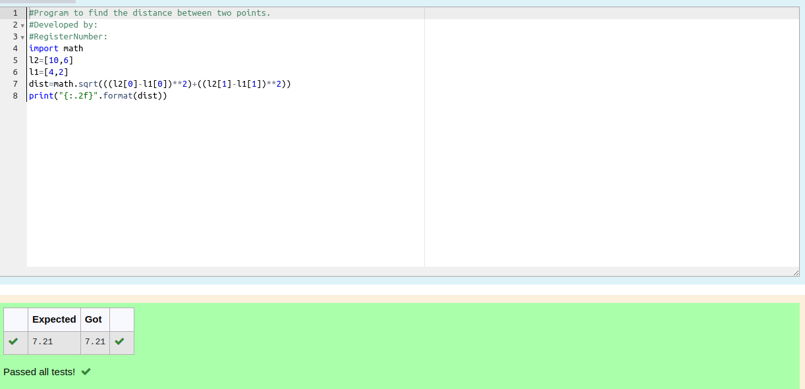

# DISTANCE-BETWEEN-TWO-POINTS

## AIM:

To write a python program to find the distance two 2 points

## ALGORITHM:

### Step 1: 
Get the value from the user 
### Step 2: 
Assign the values 
### Step 3: 
Substitute the values in the distance formula  
### Step 4: 
print the result 
### Step 5: 
End the program
### PROGRAM:
```python
#Program to find the distance between two points.
#Developed by: Premalatha.S
#RegisterNumber:22009393
import math
l2=[10,6]
l1=[4,2]
dist=math.sqrt(((l2[0]-l1[0])**2)+((l2[1]-l1[1])**2))
print("{:.2f}".format(dist))
```

### OUTPUT:


### RESULT:
Thus distance of two points created successfully
